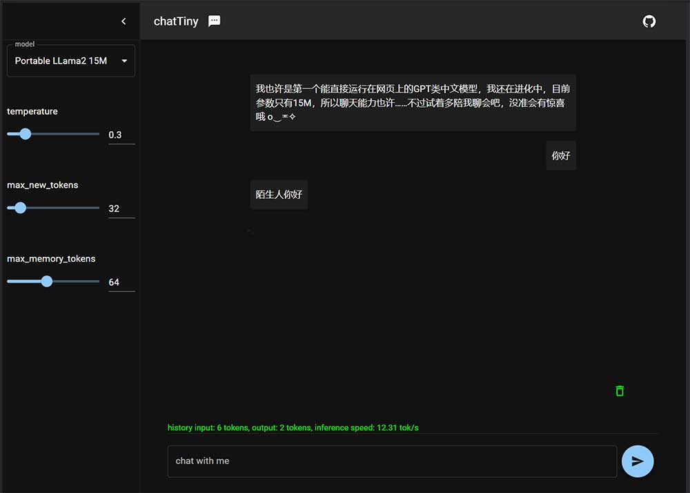

## Portable LLama2

[en](./docs/README_en.md) | [中文](./docs/README_cn.md) 


This project loads the LLama2 model into the browser using wasm technology, achieving efficient inference computing on the web.  [demo online](https://hku.github.io/pages/portable-llama2/)


screenshot:



The default model is a mini version of llama2 with 15M parameters trained over 300M Chinese dialogs. 

### Model Training

Adapted from [Karpathy's repository](https://github.com/karpathy/llama2.c). 

(will be opennd soon after cleaning the codes）

### WebAssembly Compilation

(will be opennd soon after cleaning the codes）

### Installation

1. [install node](https://nodejs.org)

2. install node packages ```npm install```

3. run the web server ```npm run start```

4. open the web link： http://localhost:3000/


### Resources

[Models](https://huggingface.co/rayvvv/yumchat_cn) | [Git](https://github.com/hku/portable-llama2) | [Gitee](https://gitee.com/hku2023/portable-llama2) 

### Acknowledgement

- Special thanks to [Karpathy](https://github.com/karpathy) for open-sourcing the llama2 code in C lang. The model training and inference codes are mainly adapted from this [repository](https://github.com/karpathy/llama2.c). 

- Special Thanks to [enscripten](https://github.com/emscripten-core/emscripten), [mui](https://github.com/mui/material-ui), and [chatGPT](https://chat.openai.com/)  


### Others

In lots of specific scenarios, portable models have advantages in terms of computational power savings, response acceleration, and data privacy. If you are interested in portable technology of LLM too, feel free to contact me ~

[twitter](https://twitter.com/RayWong48889131)

wx：

